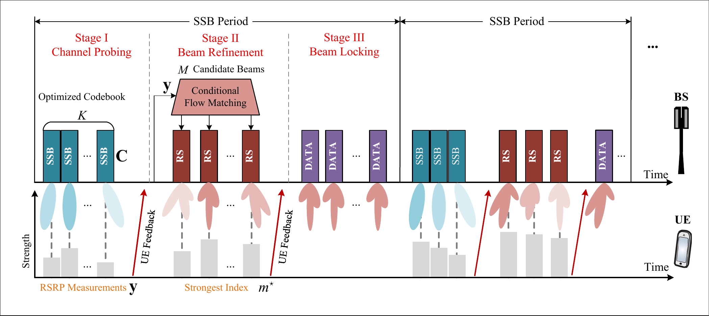
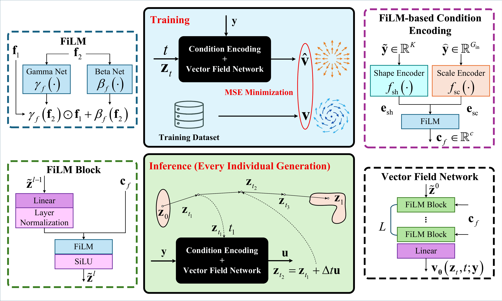

# Generative Site-Specific Beamforming via Information-Maximizing Codebook

This repository contains the core implementation of the proposed Gen-SSBF
system. It is organized around two components:

- SIM probing codebook: learns site-specific analog probing beams from channel
  data by maximizing the information volume of the RSRP feedback.
- FiLM-CFM beam generator: maps the measured RSRP vector to candidate downlink
  beams through a FiLM-conditioned conditional flow matching model.

<p align="center">
  
</p>

## Repository layout

```text
assets/                 System and model figures.
configs/                Default DeepMIMO O1/O1B system settings.
scripts/train_codebook.py
scripts/train_cfm.py
scripts/visualize_results.py
src/gen_ssbf/codebook.py
src/gen_ssbf/models.py
src/gen_ssbf/training.py
src/gen_ssbf/metrics.py
src/gen_ssbf/data.py
src/gen_ssbf/noise.py
src/gen_ssbf/plots.py
results/.gitkeep        Output placeholder. Generated files are ignored by git.
```

The main code lives in `src/gen_ssbf/`. The scripts are thin entry points around
that package, so the same modules can be imported in new experiments.

## Installation

The code was tested with:

| Package | Version |
| --- | --- |
| Python | 3.14.0 |
| PyTorch | 2.9.1, CUDA 12.6 |
| DeepMIMO | 4.0.0b11 |
| NumPy | 2.2.6 |
| scikit-learn | 1.7.2 |

A typical setup is:

```bash
conda create -n gen-ssbf python=3.11
conda activate gen-ssbf
pip install -r requirements.txt
pip install -e .
```

Install a CUDA-enabled PyTorch build if the default wheel does not detect your
GPU. The CFM training loop is intended for GPU use.

## Data

Download the DeepMIMO v4 scenarios `o1_28` and `o1b_28` from the
[DeepMIMO website](https://www.deepmimo.net/), then pass the parent scenario
directory with `--scenarios-dir`.

The default setting follows the system setup used in the paper:

| Item | Value |
| --- | --- |
| Scenarios | `o1_28`, `o1b_28` |
| BS set / index | `tx_set=4`, `tx_indices=[0]` |
| UE set | `rx_set=0` |
| UE rows | `750:1200` over 180 columns |
| Candidate UE locations | 81,000 before invalid-channel filtering |
| Split | 60/20/20 train/validation/test |
| Split seed | 7 |
| Carrier / bandwidth | 28 GHz / 100 MHz |
| Default transmit power | 40 dBm |
| Shadowing variance | 1 dB |
| Default codebook / candidates | `K=16`, `M=8` |
| Default antennas | `N_t=64` |

The same values are recorded in
`configs/default_deepmimo_o1_o1b.json`.

## Train the SIM codebook

```bash
python scripts/train_codebook.py \
  --scenarios-dir /path/to/deepmimo_scenarios \
  --scenario o1_28 \
  --K 16 \
  --epochs 300 \
  --device cuda \
  --save-codebook results/sim_codebook.pt \
  --out results/codebook_summary.json \
  --plot-dir results/figures
```

This command saves the learned analog probing codebook, the training history,
and information metrics for the normalized RSRP covariance. If `--plot-dir` is
provided, it also writes the SIM training curve and beam-pattern figure.

## Train the FiLM-CFM generator

Train CFM using a saved codebook:

```bash
python scripts/train_cfm.py \
  --scenarios-dir /path/to/deepmimo_scenarios \
  --scenario o1_28 \
  --codebook results/sim_codebook.pt \
  --K 16 \
  --M 8 \
  --cfm-epochs 120 \
  --noisy \
  --device cuda \
  --save-model results/film_cfm.pt \
  --out results/cfm_summary.json \
  --plot-dir results/figures
```

If `--codebook` is omitted, `train_cfm.py` first trains a SIM codebook and then
uses it to train CFM. The output JSON reports the CFM loss curve, validation
gap if enabled, final gap to MRT on the test set, within-1 dB and within-3 dB
rates, and sampling latency for 128 UEs.

<p align="center">
  
</p>

## Visualize saved results

The training scripts can generate figures directly. To redraw figures from
saved JSON summaries:

```bash
python scripts/visualize_results.py \
  --codebook-json results/codebook_summary.json \
  --cfm-json results/cfm_summary.json \
  --out-dir results/figures
```

Generated files under `results/` are ignored by git. Raw DeepMIMO data,
checkpoints, logs, and local experiment outputs should stay outside version
control.

## Citation

```bibtex
@article{zhao2026genssbf,
  title   = {Generative Site-Specific Beamforming via Information-Maximizing Codebook},
  author  = {Zhao, Cheng-Jie and Wang, Zhaolin and Liu, Yuanwei},
  journal = {IEEE Transactions on Signal Processing},
  year    = {2026}
}
```

## License

This code is released under the MIT License.
